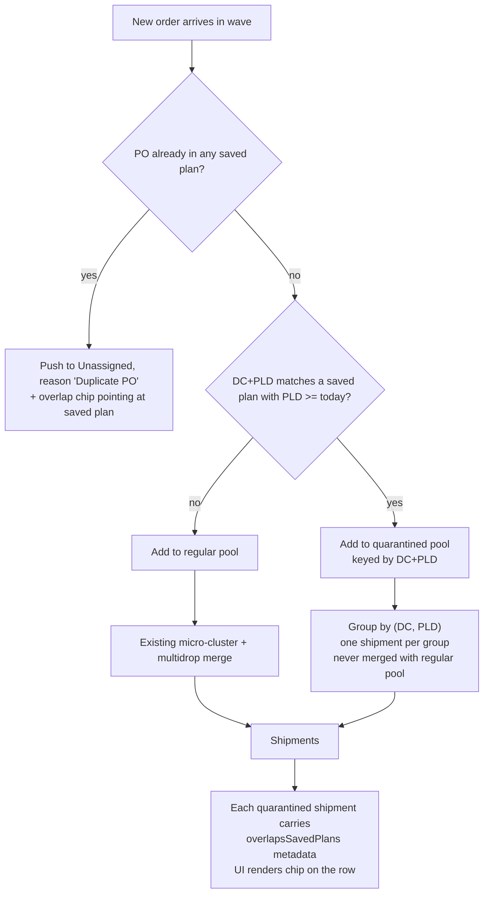

# Saved-Plan-Aware Consolidation Design

Date: 2026-04-27
Status: Approved in chat, implemented in this same change.

## Goal

When the planner consolidates a new wave, hold back any order whose `(dcName, pld)` is already on a saved plan whose `meta.pldList` contains a date today-or-later. Those orders are still planned in the new wave, but as their own single-`(DC, PLD)` shipments, never merged with non-overlapping new orders. Each resulting shipment (and any duplicate-PO unassigned row) carries metadata pointing at the matching saved plan(s); the UI renders an "Overlaps saved plan: <name>" chip linking to `/planner/saved/<id>` in a new tab.

The existing duplicate-PO guard in [src/app/api/planner/consolidate/route.ts](../../../src/app/api/planner/consolidate/route.ts) is unchanged in behavior; only its output gains the same overlap chip.

## Scope

### In scope

- A new server-side index of saved-plan `(DC, PLD)` cells, restricted to plans whose `meta.pldList` contains a future-or-today date, exposed as `GET /api/planner/saved-plans/dc-pld-index?excludePlanId=...`.
- A new server-side rich PO index (`{ po, planId, planName, shipmentId }[]`) used both for blocking and for chip metadata, exposed alongside the existing `purchaseOrders` array on `GET /api/planner/saved-plans/po-index`.
- An additive engine option `savedPlanDcPldIndex` that triggers the quarantine path. A second additive option `savedPlanPoIndex` replaces the simpler `blockedPurchaseOrders` set when richer chip metadata is available, while `blockedPurchaseOrders` stays accepted for backward compat.
- Server route + client fallback wiring that forwards the `excludePlanId` of the currently-loaded saved plan so re-running consolidation never matches the loaded plan against itself.
- A new UI chip rendered on the planner results' By DC shipment row, every affected By PO row, and the duplicate-PO unassigned rows.

### Out of scope

- Auto-merging the new wave's quarantined shipment into the saved plan.
- Mutating saved plans from the planner page.
- Loose-match overlaps (DC-only, area-only, PLD window) — strict `DC + exact PLD` only.
- Any change to consolidation behavior for orders that don't match a saved plan. Regular orders go through the same code paths as today.
- Caching layers in front of the saved-plans store; per-call reads are acceptable for current volumes.

## Match Rule

- Match key: `dcPldKey(dcName, pldIso) = dcName.trim().toLocaleLowerCase() + "|" + pldIso`. Strict, exact ISO PLD.
- Scan scope for the DC+PLD index: any saved plan whose `meta.pldList` contains an ISO date `>= today` (local time). Within those plans, only orders with `pld >= today` contribute to the index.
- Scan scope for the PO index: every saved plan, regardless of date, matching today's duplicate-PO behavior.
- Hydrate-and-rerun safety: the planner sends `excludePlanId = loadedFromSavedPlan?.id` in the consolidate POST body and on both index endpoints' query strings. Both indexes skip that plan, fixing a latent bug where the existing duplicate-PO guard would unassign every PO of the loaded plan on re-run.

## Behavior



## Engine Change

In [src/lib/consolidation/engine.ts](../../../src/lib/consolidation/engine.ts), `runConsolidation` accepts two new optional inputs and keeps the old one for backward compat:

```ts
runConsolidation(data, {
  drivingDistanceKm,
  drivingDurationMin,
  planner,
  // new
  savedPlanPoIndex?: Map<string, SavedPlanOverlapRef[]>,    // PO key -> overlap refs
  savedPlanDcPldIndex?: Map<string, SavedPlanOverlapRef[]>, // dcPldKey -> overlap refs
  // legacy, still accepted (no chip metadata)
  blockedPurchaseOrders?: Set<string>,
});
```

Internally:

1. The duplicate-PO branch uses `(savedPlanPoIndex ?? blockedPurchaseOrders).has(poKey)` for the rejection. When `savedPlanPoIndex` is set, the matching refs are attached to the unassigned record as `overlapsSavedPlans`.
2. After the per-order enrichment loop, enriched orders are partitioned into `regularEnriched` and a `quarantinedByKey: Map<string, EnrichedOrderLine[]>`. An order is quarantined iff it has a non-empty `pld` and `savedPlanDcPldIndex.has(dcPldKey(dcName, pld))`.
3. The existing micro-cluster + multidrop merge loop runs on `regularEnriched` only. No code path inside that loop is rewritten.
4. After the regular loop completes (which guarantees `groups.length === 0`), the engine drains each quarantine bucket through the existing `finalizeClusterLines` helper. Each call's newly-emitted shipments and unassigned remainders are decorated with the bucket's `overlapsSavedPlans` refs. The drain handles the `partitionClusterIntoFittingGroups` push-back path so an oversized bucket still produces one shipment per fitting sub-group.

The drain is intentionally per-bucket so that oversized splits stay tagged with the saved-plan refs of the originating bucket — never with refs from a neighboring bucket.

## Types

In [src/types/planner.ts](../../../src/types/planner.ts):

```ts
export interface SavedPlanOverlapRef {
  planId: string;
  planName: string;
  shipmentId: string;
}

export interface Shipment {
  /* existing */
  overlapsSavedPlans?: SavedPlanOverlapRef[];
}

export interface UnassignedOrder {
  order: EnrichedOrderLine | OrderLine;
  reason: string;
  overlapsSavedPlans?: SavedPlanOverlapRef[];
}
```

Both fields are optional; saved-plan replay, hydration, exports, and existing planner outputs are unchanged when no index is provided.

## Saved-Plans Store Helpers

In [src/lib/savedPlansStore.ts](../../../src/lib/savedPlansStore.ts):

- `listSavedPurchaseOrders({ excludePlanId })` extended with the option (Set return preserved for backward compat).
- New `listSavedPlanPoIndex({ excludePlanId }): Promise<SavedPlanPoIndexEntry[]>` and `buildSavedPlanPoIndexMap(entries)` — entries deduped per saved-plan shipment.
- New `listFutureDcPldIndex({ excludePlanId, today }): Promise<DcPldIndexEntry[]>`, which:
  - Reads `_index.json` to skip plans whose `meta.pldList` has no future-or-today PLD without opening the per-plan file.
  - Falls back to the per-plan file when the index is silent on a given id (consistent with the existing self-heal behavior).
  - Emits one entry per `(saved-plan shipment order)` whose normalized PLD is `>= today` (local time).

## Shared Helper

[src/lib/planner/savedPlanOverlap.ts](../../../src/lib/planner/savedPlanOverlap.ts) is the single source of truth for the key format:

- `dcPldKey(dcName, pldIso): string` — lowercased, trimmed DC + `|` + ISO PLD.
- `buildDcPldIndex(entries): Map<string, SavedPlanOverlapRef[]>` — pure helper used by both the server route and the client fallback path so the engine sees the same map shape regardless of where the input came from.

## API Routes

- [src/app/api/planner/saved-plans/dc-pld-index/route.ts](../../../src/app/api/planner/saved-plans/dc-pld-index/route.ts): `GET ?excludePlanId=...` returns `{ entries: DcPldIndexEntry[] }`.
- [src/app/api/planner/saved-plans/po-index/route.ts](../../../src/app/api/planner/saved-plans/po-index/route.ts): extended to also return `entries: SavedPlanPoIndexEntry[]` alongside the existing `purchaseOrders` field. The client fallback prefers `entries` when present.
- [src/app/api/planner/consolidate/route.ts](../../../src/app/api/planner/consolidate/route.ts): reads `excludePlanId` from the request body, fetches both indexes in parallel, and forwards them into `runConsolidation`.

## Client Fallback

[src/context/PlannerContext.tsx](../../../src/context/PlannerContext.tsx):

- Captures `loadedFromSavedPlan?.id` via a ref so the existing zero-deps `useCallback` keeps working without invalidating on every state change.
- Sends `excludePlanId` in the consolidate POST body and on both index fetches in the client fallback path.
- Builds `savedPlanPoIndex` from `entries` if present (falls back to a `blockedPurchaseOrders` Set when only the legacy field is available) and `savedPlanDcPldIndex` from the dc-pld endpoint, then passes both into `runConsolidation`.

## UI

In [src/components/planner/PlannerResults.tsx](../../../src/components/planner/PlannerResults.tsx):

- New colocated component `OverlapWithSavedPlanChip`. Single overlap renders `Overlaps saved plan: <name>` and links to `/planner/saved/<planId>`; multi-overlap renders `Overlaps N saved plans` with names in the tooltip and links to `/planner/saved`. Always opens in a new tab.
- The chip is dragged-row-safe: it stops `onMouseDown`, `onPointerDown`, `onClick`, and `onDragStart` propagation, and is `draggable={false}`, so the existing row-drag-to-reassign behavior is unaffected.
- Row builders in `buildDcSummaryRows` and `buildPoSummaryRows` thread `shipment.overlapsSavedPlans` onto each row; rendering is gated on a non-empty array.
- Three render sites:
  - **By DC** tab: chip below the shipment id in the Shipment cell.
  - **By PO** tab: chip below the shipment id on every affected row.
  - **Unassigned** tab: chip below the reason text on rows whose `overlapsSavedPlans` is set (i.e., rejected by the duplicate-PO guard with refs).

## Edge Cases

- Order with empty PLD: never quarantined. Falls through normal path.
- Multi-PLD saved shipment: each `(dcName, pld)` cell indexed independently, so only the matching cells contribute keys.
- Saved plan with all-historical PLDs: filtered out at the plan level by the `pldList >= today` check, no per-plan read needed.
- Two saved plans with the same `(DC, PLD)`: chip lists both names (single chip, multi-tooltip), still one quarantined shipment per `(DC, PLD)` in the new wave.
- Hydrated plan being re-run: excluded from both indexes via `excludePlanId`, fixing the latent duplicate-PO self-rejection bug.
- Quarantined bucket oversized: existing split / partition path runs; resulting shipments and any unassigned remainders keep their `overlapsSavedPlans`.
- Saved plan deleted between consolidate and chip click: chip link 404s into the existing "Saved plan not found" panel.
- Client fallback when the dc-pld endpoint is unreachable: consolidation still runs, just without the quarantine and without the chip — same baseline as today.

## Risks and Mitigations

- **Behavior surprise** from segregated shipments → mitigated by visible chip with link to the cause; the chip explicitly identifies the saved plan.
- **Stale data** → no caching layer; both indexes are read fresh on every consolidate call. Saved plan edits and deletions take effect immediately on the next run.
- **Index drift from saved-plans CRUD** → the existing self-heal in `_index.json` makes the index a cache rather than a source of truth, and `listFutureDcPldIndex` falls back to the per-plan file when the index is silent on an id.
- **Performance on many saved plans** → for current volumes, per-call full reads are acceptable. `listFutureDcPldIndex` already short-circuits plans with no future PLD using `meta.pldList`. Future optimizations (mtime-keyed memo, restrict to wave-overlapping PLDs) are additive.
- **Latent bug surfaced** → today's duplicate-PO guard would unassign all POs of a hydrated plan on re-run. Fixed for free by `excludePlanId` propagation in this change.

## Testing Plan

- Engine: matched `(DC, PLD)` becomes a single-DC shipment with overlap metadata; two matched orders for the same key merge with each other only; non-matched orders consolidate exactly as today.
- Engine: oversized quarantined group falls through to split/unassigned with overlap metadata preserved on every emitted shipment and on overflow unassigned rows.
- `excludePlanId`: hydrate plan X, re-run consolidation; nothing in plan X's orders is unassigned by the duplicate-PO guard, nothing is quarantined against plan X.
- `listFutureDcPldIndex`: a plan whose every PLD is yesterday is excluded; mixed-PLD plan only contributes future-or-today cells.
- API routes: round-trip for `dc-pld-index` and the extended `po-index`; `excludePlanId` honored.
- UI: chip renders on By DC, By PO, Unassigned; multi-overlap tooltip; link target opens in new tab; chip absent when no metadata; row drag still works when starting from a non-chip area.

## Implementation Boundary

Engine, store helpers, two API routes (one new, one extended), one context wiring, one UI chip, and three render sites. No change to consolidation behavior for orders that don't match any saved plan. No change to saved-plan CRUD, the saved-plans list page, the saved-plan detail page, the route map, or the existing exports.
